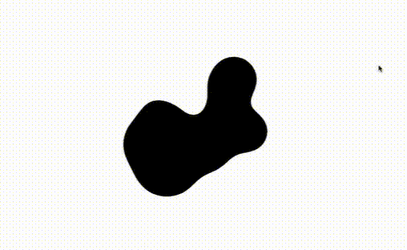

## Imaging Technique Inspiration

When conducting my research for the imaging technique I could later use in the Major Project I have focused on how shapes could be transformed in a "flowy" way when the user interacts with them. I have found a decent number of animated artworks mimicking fluid dynamics which results in a creation of some highly interesting shapes. Here's some of my favourite ones:


*__example 1.__* *unknown author, source: Pinterest.com*


*__example 2.__* *(c) 2017, Micah Buzan, 'adult swim', source: giphy.com*

I recon that some of artworks provided for the Major Project could provide with a great base for such interaction/animation. I believe that adding this possibility to create some organic and pleasant shapes will result in a creation of a truly engaging artwork.

## Coding Techniques

Coding technique I recon would be crucial to achieve such effects is the `noise()` function.


*__coding technique in action__, (c) 2023, [web art](https://www.youtube.com/@web_artt), Dynamic Loading Liquid Animation Tutorial | Fluid Elegance with HTML, CSS, p5.js*

In the following __[tutorial](https://www.youtube.com/watch?v=4wyCr_hhxjs)__ by  *[web art](https://www.youtube.com/@web_artt)* the `noise()` function is used in order to achieve a dynamic liquid animation effect. By returning random values between 0 and 1 this function produces arbitrary, however 'smooth' changes to the code allowing the parameters of the objects and elements to be altered in a steady but unsysthematic manner. This can bring a highly organic and natural feel to the movement of the elements and cause a soothing and pleasant experiance for the artwork's audience.

___

*since the source of the code is a youtube coding tutorial I have re-written the code to be able to provide with its example in a 'written
 form:*

 __HTML__
```
<!DOCTYPE html>
<html lang="en">
  <head>
    <meta charset="utf-8" />
    <meta name="viewport" content="width=device-width, initial-scale=1.0">

    <title>fluid</title>

    <link rel="stylesheet" type="text/css" href="style.css">

   
  </head>

  <body>
    <div class="background-animation-container"
    style="position: fixed; top: 0; left:0; width: 100vw; height: 100vh; background: white; display: flex; justify-content: center; align-items: center;">
    </div>
    <script src="sketch.js"></script>
    <script src="libraries/p5.min.js"></script>
  </body>
</html>
```
*(c) 2023, [web art](https://www.youtube.com/@web_artt), Dynamic Loading Liquid Animation Tutorial | Fluid Elegance with HTML, CSS, p5.js*

 __JS__
```
let shapesCount = 20;
let maxSize = 10;
let scl = 40;
let inc = 0.1;
let time = 2500;

let z = 0;

function setup()
{
  let backgroundContainer = document.querySelector(".background-animation-container");
  let bgWindow = document.createElement('div');

  bgWindow.setAttribute('style', 'position: fixed; top: 0; left: 0; width: 100%; height: 100%; backdrop-filter: blur(20px) contrast(100);');

  let shapes = [];

  for(let i = 0; i < shapesCount; i++)
  {
    let shape = document.createElement('div');
    let sz = random(maxSize);
    shape.setAttribute('style', `transition: ${time}ms; position: fixed; background: black; border-radius: 1000rem; width:${sz}rem; height:${sz}rem;`);
  
    backgroundContainer.append(shape);
    shapes.push(shape);
  }

  backgroundContainer.append(bgWindow);

  setInterval(() => {
    shapes.forEach((shape) => {
    let newScl = noise(z) * scl * 4 ;
    let deg = random(TWO_PI);

    shape.style.transform = `translate(${cos(deg) * newScl}px, ${sin(deg) * newScl}px)`;

      z += inc; 

    });
}, time);
}
```
*(c) 2023, [web art](https://www.youtube.com/@web_artt), Dynamic Loading Liquid Animation Tutorial | Fluid Elegance with HTML, CSS, p5.js*